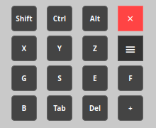
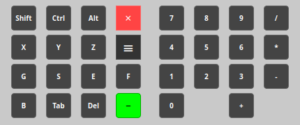

# blender_accessibility

A lightweight Qt-based control panel application for sending keyboard events to specific windows, with special optimization for Blender 3D.

Status: Working | Qt6 | Platform: Linux

## Features

- Window Targeting: Select specific application windows to control with robust multi-method detection
- Raw Input Events: Send keyboard events directly to target applications  
- Blender Optimized: Special focus handling for Blender's 3D viewport
- Smart Mouse Positioning: Remembers your work area and moves mouse intelligently
- Lockable Modifiers: Three-state Shift, Ctrl, Alt with visual feedback (Off -> Green -> Red Locked)
- Expandable Numpad: Full numeric keypad with operators that extends from the main panel
- Comprehensive Key Set: G, E, S, X, Y, Z, F, B, Tab, Del for common Blender operations
- Position Memory: Remembers window position between sessions
- Always on Top: Stays visible above other windows
- Draggable Interface: Move the control panel anywhere on screen

## Screenshots

Collapsed View - Compact interface for daily use  



Expanded View - Full numpad for numeric input 



## Installation

### Prerequisites

```bash
# Ubuntu/Debian
sudo apt-get install qt6-base-dev libx11-dev cmake build-essential

# Fedora/RHEL  
sudo dnf install qt6-qtbase-devel libX11-devel cmake gcc-c++
```

### Build from Source

```bash
# Clone the repository
git clone https://github.com/fivethreeo/blender_accessibility.git
cd blender_accessibility

# Create build directory
mkdir build
cd build

# Configure and build
cmake ..
make

```

### Permissions Setup

For accessing input devices without sudo:

```bash
# Add your user to the input group
sudo usermod -a -G input $USER

# You may need to logout/login for changes to take effect
```

## Usage

1. Run the application:
   ```bash
   ./ControlPanel  # or sudo ./ControlPanel if permissions not set
   ```

2. Select Target:
   - Choose the target window (e.g., Blender)
   - Select your keyboard device from the list  
   - Click "Start Control"

3. Button Functions:

Button       Function              Behavior
Shift/Ctrl/Alt Three-state toggle  Off -> Active (Green) -> Locked (Red) -> Off
X, Y, Z      Axis keys            Common transform axes
G, S, E, F   Grab, Scale, Extrude Essential modeling tools  
B, Tab, Del  Box Select, Mode     Selection and editing
+            Numpad Toggle        Expand/collapse numeric keypad
×            Close Application    Exit ControlPanel
≡            Drag Panel           Reposition control panel

4. Modifier Key Behavior:
   - First Click: Activates modifier (green) - turns off with other keys
   - Second Click: Locks modifier (red) - stays active permanently
   - Third Click: Turns off modifier

5. Smart Mouse Features:
   - Tracks mouse position for 3 seconds with 25px fuzzy tolerance
   - Moves to your most frequent work area when buttons are clicked
   - Numpad keys return mouse to original position

## Technical Details

### Architecture
- Frontend: Qt6 Widgets application with expandable layout
- Backend: X11 window management + Linux input subsystem
- Input: Raw keyboard event injection via /dev/input/ devices
- Mouse Tracking: Continuous position monitoring with frequency analysis

### Smart Mouse Algorithm
- Records mouse position every 50ms (3-second history)
- Groups positions within 25px tolerance for area detection
- Finds most frequent work area using FIFO queue
- Stores position when entering control panel

### Window Detection
Uses multiple methods for robust window enumeration:
1. _NET_CLIENT_LIST (modern window managers)
2. XQueryTree (fallback method)
3. _NET_CLIENT_LIST_STACKING (alternative property)
4. Filters system windows (desktop, panels, docks)

### Supported Systems
- Linux with X11 window system
- Qt6 compatible distributions
- Kernel 4.4+ with input subsystem support

## Troubleshooting

### Common Issues

1. "No keyboard devices found":
   ```bash
   # Check available devices
   ls /dev/input/by-id/
   
   # Ensure you have permissions
   ls -l /dev/input/by-id/
   ```

2. "Failed to open keyboard device":
   ```bash
   # Run with sudo or set permissions
   sudo ./ControlPanel
   ```

3. Windows not detected:
   - Use the Refresh button in the setup dialog
   - Ensure target applications have visible windows
   - Some applications may use non-standard windowing

4. Mouse positioning issues:
   - Move mouse to desired area before using buttons
   - The system learns your work area over 3 seconds

### Debug Mode

Run with debug output:
```bash
./ControlPanel 2>&1 | tee debug.log
```

## Building for Development

```bash
# Debug build with symbols
cmake -DCMAKE_BUILD_TYPE=Debug ..
make

# Release build
cmake -DCMAKE_BUILD_TYPE=Release ..
make
```

## Blender Workflow Tips

1. Modeling Workflow:
   - Lock Shift for precise movement
   - Use G, S, E for grab, scale, extrude
   - X, Y, Z for axis constraints
   - Expand numpad for numeric input

2. Navigation:
   - Use locked modifiers for extended operations
   - Smart mouse positioning keeps you in your work area
   - Numpad for precise numeric transformations

3. Efficiency:
   - Keep common modifiers locked during complex operations
   - Use the compact view for daily work
   - Expand numpad only when needed for numbers

## Contributing

1. Fork the repository
2. Create a feature branch (git checkout -b feature/amazing-feature)
3. Commit your changes (git commit -m 'Add amazing feature')
4. Push to the branch (git push origin feature/amazing-feature)
5. Open a Pull Request

## License

This project is licensed under the MIT License - see the LICENSE file for details.

## Acknowledgments

- Qt Framework for the excellent cross-platform GUI library
- X11 developers for window management capabilities
- Blender community for inspiration and workflow optimization

## Support

If you encounter any issues or have questions:

1. Check the Troubleshooting section
2. Search existing Issues
3. Create a new issue with detailed information

---

Note: This application requires appropriate permissions to access input devices. 