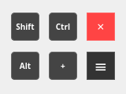

# blender_accessibility

A lightweight Qt-based control panel application for sending keyboard events to specific windows, with special optimization for Blender 3D.

  

## Features

- **Window Targeting**: Select specific application windows to control
- **Raw Input Events**: Send keyboard events directly to target applications
- **Blender Optimized**: Special focus handling for Blender's 3D viewport
- **Toggle Buttons**: Visual toggle states for Shift, Ctrl, and Alt modifiers
- **Action Button**: Send Numpad + key presses
- **Smart Mouse Return**: Automatically returns mouse to control panel after operations
- **Position Memory**: Remembers window position between sessions
- **Always on Top**: Stays visible above other windows
- **Draggable Interface**: Move the control panel anywhere on screen

## Screenshot



## Installation

### Prerequisites

```bash
# Ubuntu/Debian
sudo apt-get install qt6-base-dev libx11-dev cmake build-essential

# Fedora/RHEL
sudo dnf install qt6-qtbase-devel libX11-devel cmake gcc-c++
```

### Build from Source

```bash
# Clone the repository
git clone https://github.com/fivethreeo/blender_accessibility.git
cd ControlPanel

# Create build directory
mkdir build
cd build

# Configure and build
cmake ..
make

# Install (optional)
sudo make install
```

### Permissions Setup

For accessing input devices without sudo:

```bash
# Add your user to the input group
sudo usermod -a -G input $USER

# You may need to logout/login for changes to take effect
```

## Usage

1. **Run the application**:
   ```bash
   ./ControlPanel  # or sudo ./ControlPanel if permissions not set
   ```

2. **Select Target**:
   - Choose the target window (e.g., Blender)
   - Select your keyboard device from the list
   - Click "Start Control"

3. **Control Panel Operations**:

| Button | Function | Blender Use Case |
|--------|----------|------------------|
| Shift | Toggle Left Shift | Precise movement, snapping |
| Ctrl | Toggle Left Control | Measurements, constraints |
| Alt | Toggle Left Alt | Duplicate, special operations |
| + | Send Numpad Plus | Zoom in, add objects |
| × | Close Application | Exit ControlPanel |
| ≡ | Drag Panel | Reposition control panel |

4. **Blender Workflow**:
   - The panel is optimized for Blender - it ensures proper 3D view focus
   - Mouse automatically returns to button position after operations
   - Perfect for navigation and quick modifier key toggling


## Technical Details

### Architecture
- **Frontend**: Qt6 Widgets application
- **Backend**: X11 window management + Linux input subsystem
- **Input**: Raw keyboard event injection via /dev/input/ devices

### Supported Systems
- Linux with X11 window system
- Qt6 compatible distributions
- Kernel 4.4+ with input subsystem support

## Troubleshooting

### Common Issues

1. **"No keyboard devices found"**:
   ```bash
   # Check available devices
   ls /dev/input/by-id/
   
   # Ensure you have permissions
   ls -l /dev/input/by-id/
   ```

2. **"Failed to open keyboard device"**:
   ```bash
   # Run with sudo or set permissions
   sudo ./ControlPanel
   ```

3. **Window not focusing properly**:
   - Ensure the target application is running
   - Try selecting the window again from the dialog

### Debug Mode

Run with debug output:
```bash
./ControlPanel 2>&1 | tee debug.log
```

## Building for Development

```bash
# Debug build with symbols
cmake -DCMAKE_BUILD_TYPE=Debug ..
make

# Release build
cmake -DCMAKE_BUILD_TYPE=Release ..
make
```

## Contributing

1. Fork the repository
2. Create a feature branch (git checkout -b feature/amazing-feature)
3. Commit your changes (git commit -m 'Add amazing feature')
4. Push to the branch (git push origin feature/amazing-feature)
5. Open a Pull Request

## License

This project is licensed under the MIT License - see the LICENSE file for details.

## Acknowledgments

- Qt Framework for the excellent cross-platform GUI library
- X11 developers for window management capabilities
- Blender community for inspiration

## Support

If you encounter any issues or have questions:

1. Check the Troubleshooting section
2. Search existing Issues
3. Create a new issue with detailed information

---

**Note**: This application requires appropriate permissions to access input devices. Use responsibly and only on systems you own or have permission to control.
